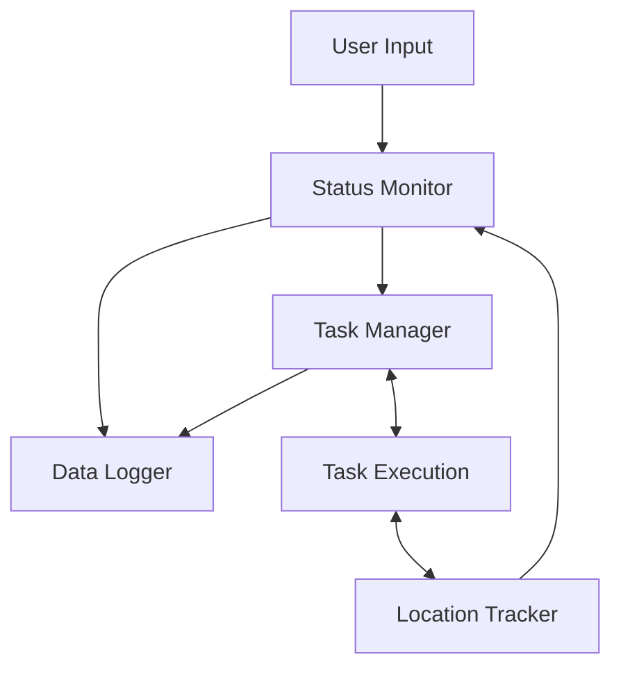

# ROS2 Warehouse Management Simulation

## Overview
A C++ ROS2 warehouse automation simulation featuring a distributed, multi-node architecture for state control, autonomous task scheduling, real-time location tracking and resource management.

The system orchestrates end to end mission execution from battery monitoring and task cycling to graceful node termination. After program termination, the system generates comprehensive JSON telemetry reports to analyze operational efficiency and task performance.

## Latest Update: v1.2
**Battery Resource Management**

Version 1.2 introduces autonomous battery monitoring and state shifting to charge status. The robot continuously tracks its battery level during operation and can temporarily suspend mission execution when power reaches a critical threshold.    

**Key Features:**
- **Charging Status:** Added a dedicated operational state that directs the robot to navigate to the charging station.
- **Charging Station:** New waypoint located at (0,5) in warehouse.
- **Head to Charger:** Robot now goes to the charger in the warehouse after turning to charging status.
- **JSON Reporting:** Mission reports now include initial charge, final charge, lowest recorded charge, and charging cycle statistics.
## Features
- Multi-node ROS2 architecture
- Warehouse task scheduling and execution
- Continuous task queue cycling
- Real-time location tracking
- Robot status monitoring
- Automated JSON mission report generation
- Mission duration and timing analysis
- Performance logging and task completion metrics
- Battery resource management
- External mission override
- Automated mission finalization and graceful node termination

## System Architecture



## Node Responsibilities
| Node                 | Responsibility                                                                                                                    |
| -------------------- | --------------------------------------------------------------------------------------------------------------------------------- |
| **Status Monitor**   | Receives operator commands, manages the robot's current operational state and monitors the robot's battery resource |
| **Task Manager**     | Central coordinator responsible for task scheduling, mission progression and workflow decisions. |
| **Task Execution**   | Executes warehouse tasks based on current state and reports task completion status.|
| **Location Tracker** | Maintains the robot's current position and provides navigation feedback.|
| **Data Logger**      | Records recording frequency, task completion statistics, battery report data and generates JSON mission reports.|

## Warehouse Layout
```text
Y
^
10|  . . . . . . . . . . .
9 |  . . . . . . . . . . .
8 |  . W . . . S . . . . .
7 |  . . . . . . . . . . .
6 |  . . . . . . . . . . .
5 |  C . . . . . . . . . D
4 |  . . . . . . . . . . .
3 |  . . . . . . . . . . .
2 |  . . . . . . . . . P .
1 |  . . . U . . . B . . .
0 |  O . . . . . . . . . .
  +------------------------> X
     0 1 2 3 4 5 6 7 8 9 10
```

### Legend
| Symbol | Location | Coordinates |
|----------|----------|----------|
| O | Origin / Home Base | (0,0) |
| U | Package Pick Up | (3,1) |
| B | Box Station | (7,1) |
| P | Package Popcorn | (9,2) |
| W | Wrapping Station | (1,8) |
| S | Sealing Station | (5,8) |
| D | Delivery Station | (10,5) |
|C  | Charging Station | (0,5) |

## Example Mission Report
```json
{
  "report_timestamp": "2026-06-13_19-15-59",
  "mission_duration": "4m 47.23s",
  "target_publishing_rate": "4.00 Hz",
  "average_publishing_rate": "3.63 Hz",
  "total_tasks_completed": 16,
  "full_rounds_completed": 2,
  "tasks_completed": {
    "Package Pick Up": 3,
    "Box": 3,
    "Package Popcorn": 3,
    "Wrapping": 3,
    "Sealing": 2,
    "Delivery": 2
  },
  "battery_report": {
    "initial_battery_level": "100.00%",
    "final_battery_level": "74.90%",
    "lowest_battery_level": "8.30%",
    "charging_cycles": 1
  }
}

```
## System Verification Results
| Condition | Result |
| :--- | :--- |
| Target Publishing Rate | 4.00 Hz |
| Observed Publishing Rate | 3.63 Hz - 4.00 Hz |
| Maximum Tasks Completed | 30 consecutive tasks |
| Longest Validation Run | 5 mission cycles |
| Graceful Shutdown Verified | Passed |
| Task Continuity After Charging| Passed|

## Technologies
- ROS2
- C++
- CMake
- JSON
- Publisher-Subscriber Architecture
- Distributed Node Communication
- State Machine Design
- Task Scheduling and Mission Management
- Operator Initiated Mission Termination
- Battery Resource Management
- Telemetry and Performance Reporting

## Version History
- **v1.0:** Task Looping + JSON Reporting
- **v1.1:** Closing + Return to Base
- **v1.2:** Battery Management + Charging Station

## Roadmap
- **v1.3:** Mission Interruption + Recovery
- **v2.0:** Fleet Communication

## Author
Lucas Kwan